# Medical referrals

## Assumption of the project
I have noticed that family member got in paper a medical referral for different tests. I came up with an idea to create an app allowing users to prescribe relevant tests (doctor) as well as to see prescribed tests and to print them (patients)  

## Overview

1. Welcome page with tabs to create users or log in

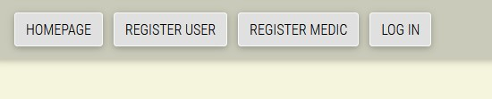

2. Form for user creation

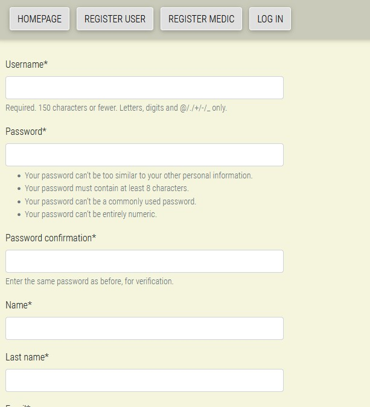

3. Login page

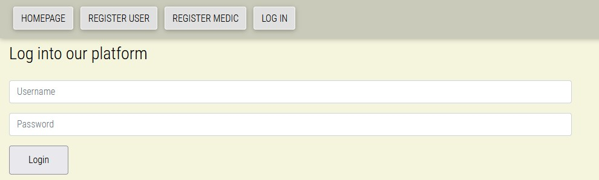

 
4. Option to check referral details

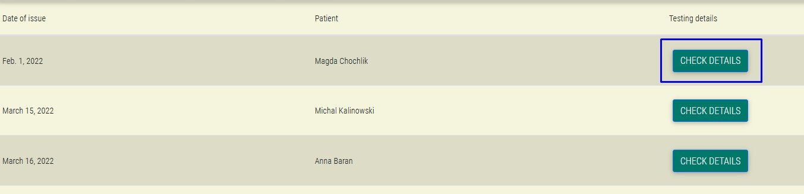

5. Possibility (for doctors) to create referrals

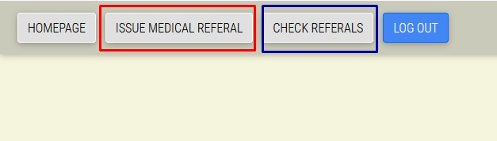

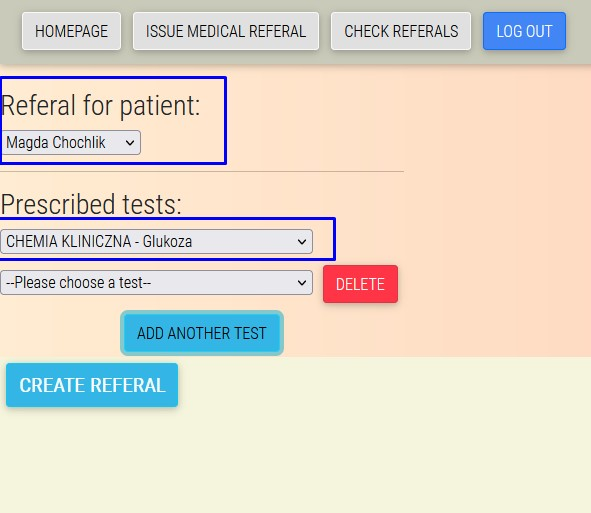

6. Option to modify or delete a referral by doctor

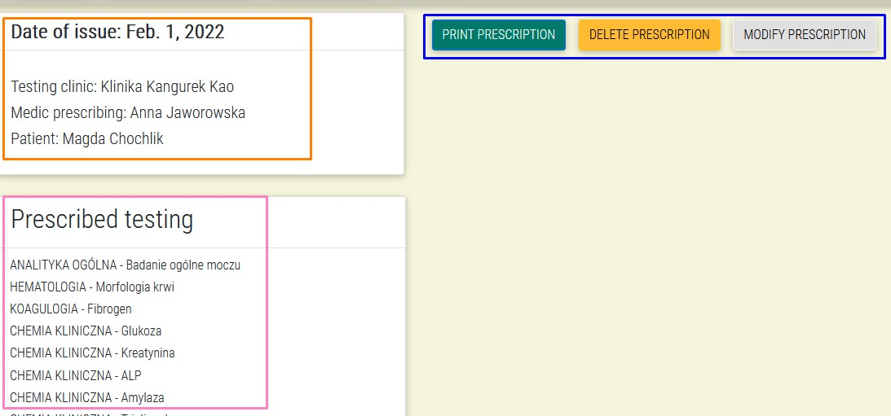

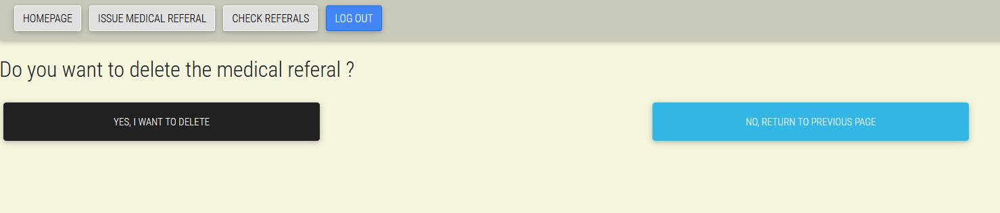

7. Option for user to only check details

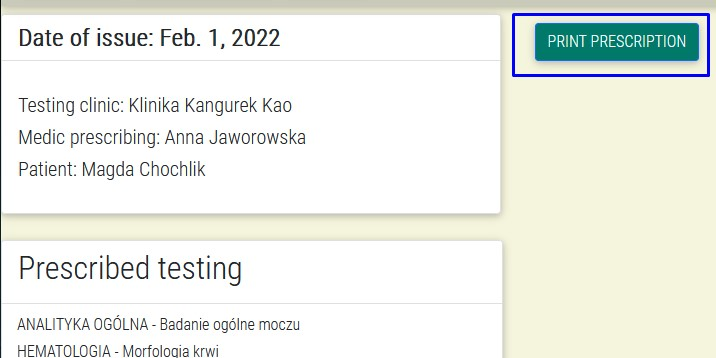

8. Option to print referral

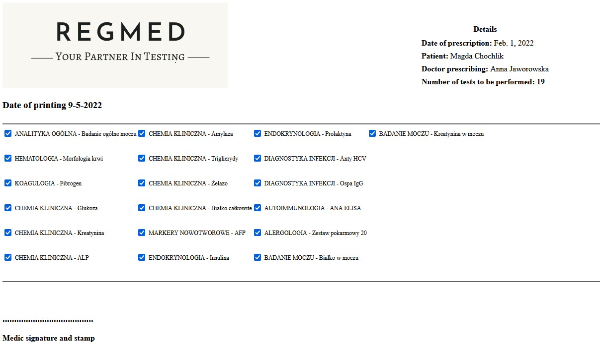

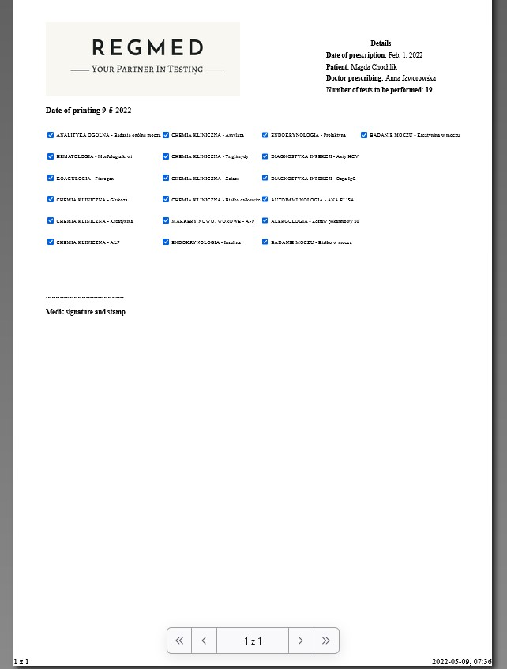

9. Logout

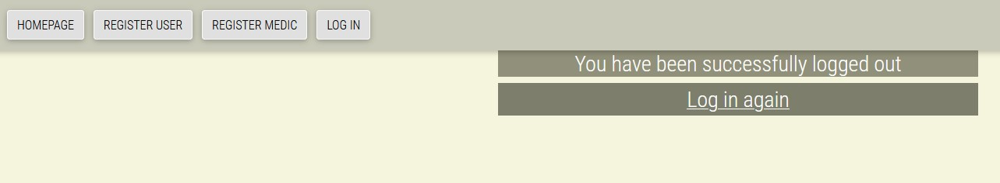

## Technologies
* Python (django)
* HTML and CSS